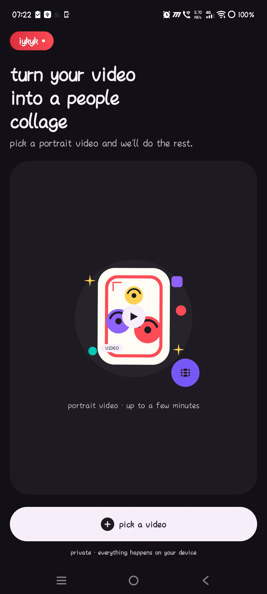
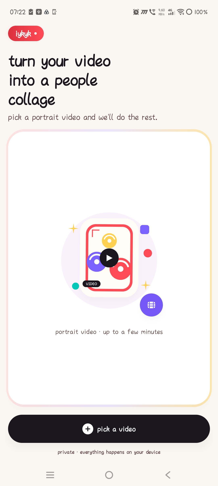
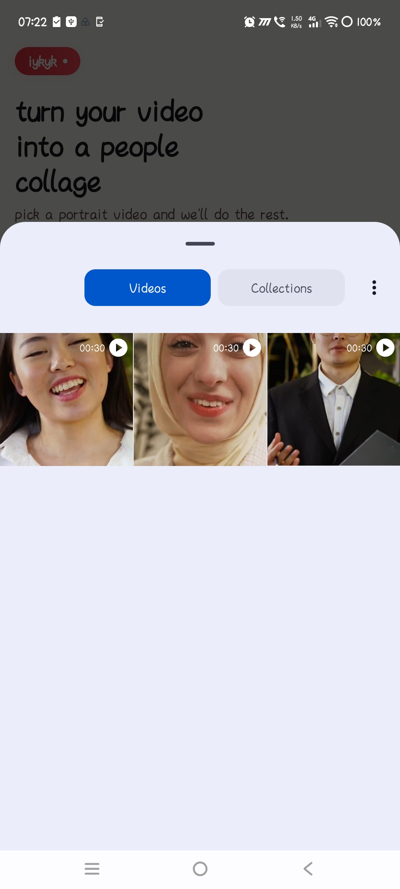
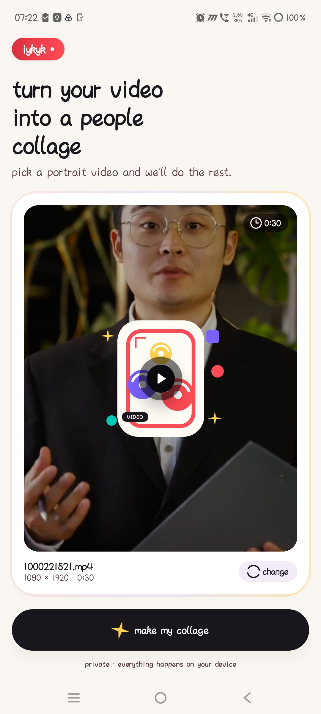
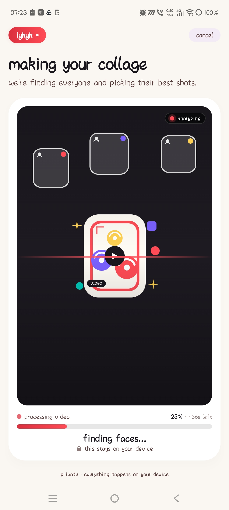
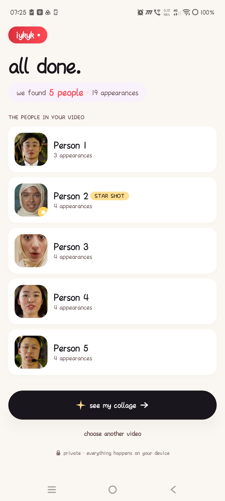
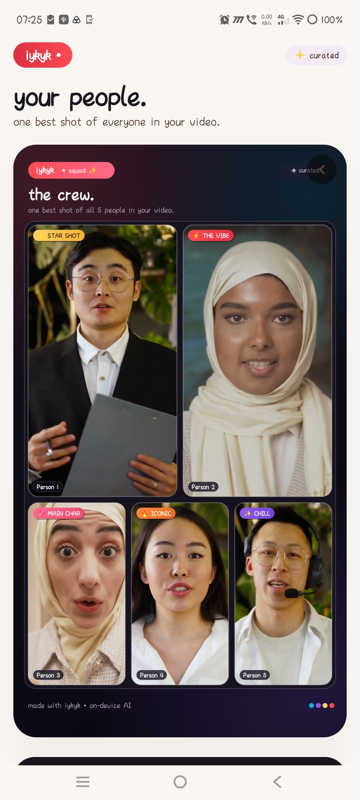

# iykyk — Video-Based Unique-Person Collage (Android)

`iykyk` is a fully on-device Android application built in **Kotlin** and **Jetpack Compose** that processes portrait videos, detects human faces, tracks continuous visible appearances, clusters appearances into unique person identities, selects high-quality representative shots, and generates a shareable bento-style collage.

---

## 🎬 Demo Video

[](YOUR_GOOGLE_DRIVE_DEMO_VIDEO_LINK_HERE)

> 📌 **Demo Video Link**: [GOOGLE_DRIVE_DEMO_VIDEO_LINK_HERE](YOUR_GOOGLE_DRIVE_DEMO_VIDEO_LINK_HERE)
>

---

## 📋 Deliverables & Submission Summary

| Deliverable | Location / Access Link |
| :--- | :--- |
| **Git Repository** | [Current Repository Root](./) |
| **Demo Video (Google Drive)** | [Google Drive Demo Video Link](YOUR_GOOGLE_DRIVE_DEMO_VIDEO_LINK_HERE) |
| **Debug APK** | `app/build/outputs/apk/debug/app-debug.apk` |
| **Target Platform** | Android 8.0+ (`minSdk 26`, `compileSdk 37`, `targetSdk 37`) |

---

## 📸 Application Screenshots

| Screen 1: Video Selection | Screen 2: Processing Pipeline | Screen 3: Live Progress & Logs |
| :---: | :---: | :---: |
|  |  |  |
| *Home screen with video picker and sample video quick selectors.* | *Off-main-thread processing showing live progress bar & active phase.* | *Detailed stage indicators for sampling, face detection & embedding.* |

| Screen 4: Person Identities & Counts | Screen 5: Representative Shot Selection |
| :---: | :---: |
|  |  |
| *Clustered unique person identities displaying appearance counts per individual.* | *Quality-based representative frame selection with high frontality & eye openness.* |

| Screen 6: Final Bento Collage | Screen 7: Save to Gallery & Share |
| :---: | :---: |
|  |  |
| *Adaptive 9:16 portrait bento collage layout with generous face framing.* | *One-tap save to system gallery (`MediaStore`) and native Android share sheet.* |

---

## 🌟 Key Features & Requirements Coverage

- **100% On-Device Processing**: Runs entirely local on the Android device with zero server/backend communication and no internet permissions.
- **Off-Main-Thread Processing**: Video decoding, ML Kit face detection, and TFLite neural inference run on background coroutines (`Dispatchers.Default` & `Dispatchers.IO`), keeping the UI completely fluid and responsive.
- **Three-Stage Person Identification**: Combines **ML Kit Face Detection**, **FaceNet 512-D Neural Embeddings**, and **Cannot-Link Constrained Agglomerative Clustering**.
- **Appearance Counting & Unique Identity Collage**: Counts continuous visible appearances per person and renders a collage containing every detected individual exactly once.
- **Quality-Based Representative Shot Selection**: Multi-attribute frame scoring evaluating pose frontality, eye openness, smile/expression probability, face size, clipping margins, and Laplacian image sharpness.
- **Generous Aspect-Ratio Framing**: Avoids tight, low-resolution bounding box crops by cropping generously around the face and shoulders (1.9x width, 2.2x height) to produce high-resolution, presentable collage tiles.
- **Adaptive Bento Collage Layouts**: Dynamically renders a 1080x1920 (9:16 portrait) canvas adapting layout structures for 1 to 9+ unique identities.
- **Save & Share Integration**: Save generated collages directly to the system gallery (`MediaStore`) and share via the native Android system share sheet (`ACTION_SEND`).

---

## ⚙️ Architecture & Pipeline Overview

The core processing engine operates in a 6-phase pipeline:

```
[ Selected Video (Uri) ]
           │
           ▼
1. Adaptive Frame Decoding & Sampling (VideoProcessor)
           │
           ▼
2. Face Detection & Quality Filtering (ML Kit Vision)
           │
           ▼
3. Spatial-Temporal Tracklet Generation (AppearanceSegmenter)
           │
           ▼
4. Aligned Facial Feature Extraction (FaceNet 512 TFLite)
           │
           ▼
5. Cannot-Link Constrained Clustering (IdentityGrouper)
           │
           ▼
6. Multi-Attribute Quality Shot Selection (RepresentativeFrameSelector)
           │
           ▼
[ Adaptive 9:16 Bento Collage Generation (CollageGenerator) ]
```

### 1. Frame Sampling & Quality Filter
- **Adaptive Frame Sampling**: Videos $\le 35\text{s}$ are sampled at $100\text{ms} - 200\text{ms}$ intervals ($5 - 10\text{ fps}$). Longer videos scale intervals dynamically to cap total sampled frames while maintaining high temporal coverage.
- **Fault-Tolerant Decoding**: Consecutive frame batch extraction (`getFramesAtIndex` on API 28+) is wrapped in per-chunk exception handling. Empty/corrupted frame batches are skipped without process crashes.
- **Spurious Face Filter**: ML Kit face detection uses a minimum face dimension limit ($\ge 4\%$ of min frame dimension) and aspect ratio filter ($0.35 \le w/h \le 2.2$) to discard background textures, curtains, and wall patterns.

### 2. Appearance Segmentation
- Tracks faces across contiguous sampled frames using **Velocity Motion Prediction** ($(x_k, y_k) = (x_{k-1} + v_x \Delta t, y_{k-1} + v_y \Delta t)$) and **Bounding Box IoU**.
- Maintains a 0.8-second memory gap (`MAX_TRACK_GAP_MS = 800L`) so temporary head turns or brief occlusions do not fragment a single appearance into separate tracks.

---

## 🧠 ML Models & Mathematical Specifications

### On-Device Embedding Model
- **Model Architecture**: **FaceNet 512** (`facenet_512.tflite`, 23.3 MB located in `app/src/main/assets/`).
- **Input Tensor**: `[1, 160, 160, 3]` (Float32). RGB pixels normalized via $(p - 127.5) / 128.0$.
- **Output Tensor**: `[1, 512]` (Float32). Outputs a 512-dimensional facial feature embedding vector normalized to unit $L_2$ length ($\|v\|_2 = 1.0$).
- **Face Landmark Alignment**: Before feeding face crops into FaceNet 512, ML Kit landmark detection locates left and right eye coordinates. The face crop is rotated around its center point by $-\theta$ where $\theta = \text{atan2}(dy, dx)$ to level the eyes horizontally.

### Similarity Thresholds & Clustering Constraints
- **Cosine Similarity Metric**:
  $$\text{CosineSimilarity}(u, v) = \frac{u \cdot v}{\|u\|_2 \|v\|_2}$$
- **Chosen Clustering Thresholds**:
  - **Seed Discovery Threshold** (`SEED_FACE_THRESHOLD`): `0.60f`
  - **Identity Post-Merge Threshold** (`MERGE_THRESHOLD`): `0.55f`
  - **Tracking Re-Identification Threshold** (`EMBEDDING_SIM_THRESHOLD`): `0.45f`
- **Cannot-Link Time-Overlap Constraint**:
  $$\text{Overlap}(i, j) = 1 \implies \text{Similarity}(i, j) = 0$$
  If two appearance segments share any overlapping timestamp in the video, they are assigned a hard *Cannot-Link* constraint. A single physical human cannot exist in two separate locations simultaneously in the same video frame.

---

## 📊 Representative Frame Quality Scoring

Candidate shots in each appearance segment are evaluated using the following weighted multi-attribute formula:

$$\text{Total Score} = 0.285 \cdot S_{\text{frontality}} + 0.2375 \cdot S_{\text{eye}} + 0.095 \cdot S_{\text{smile}} + 0.19 \cdot S_{\text{size}} + 0.1425 \cdot S_{\text{clipping}} + 0.05 \cdot S_{\text{sharpness}}$$

1. **Frontality ($28.5\%$)**: $0.7 \times (1 - \frac{|\text{yaw}|}{45^\circ}) + 0.3 \times (1 - \frac{|\text{roll}|}{30^\circ})$.
2. **Eye Openness ($23.75\%$)**: $\min(\text{leftEyeOpenProb}, \text{rightEyeOpenProb})$.
3. **Expression ($9.5\%$)**: $\text{smilingProbability}$.
4. **Face Size ($19.0\%$)**: Face area relative to frame size.
5. **Clipping Margin ($14.25\%$)**: Normalized distance from frame boundaries.
6. **Sharpness ($5.0\%$)**: Laplacian variance across grayscale pixels inside the face region.

---

## 🧪 Test Set Validation & Worked Example

### Sample 1 Ground Truth Verification
- **Expected**: 5 distinct people, each appearing 4 times (20 total appearances).
- **Shared Frames**:
  - Person A & Person B share the frame at 10.1s - 11.5s.
  - Person C & Person D share the frame at 20.2s - 21.6s.
- **Pipeline Behavior**:
  - The *Cannot-Link* time-overlap rule guarantees Person A and B are never merged despite high spatial proximity.
  - Appearance segmenter registers 20 discrete appearances.
  - Identity Grouper groups them into exactly 5 unique Person Identities with 4 appearances each.
  - Collage Generator produces a 5-tile bento layout displaying Person 1 through 5 once each, with appearance counts shown on each tile badge.

---

## 🎯 Requirements Compliance Matrix

| Requirement | Implementation Details | Status |
| :--- | :--- | :--- |
| **Language & Min SDK** | Kotlin 100%, Jetpack Compose Material 3, `minSdk = 26` | ✅ Fullfilled |
| **Generic Video Processing** | Dynamic video processing via `MediaMetadataRetriever` / `MediaCodec` without hardcoding sample outputs | ✅ Fullfilled |
| **Progress Reporting** | Animated Compose progress UI with stage text and live percentage | ✅ Fullfilled |
| **Off-Main-Thread Execution** | Coroutine workers (`Dispatchers.Default` & `IO`) | ✅ Fullfilled |
| **3-Stage Person Grouping** | ML Kit Face Detection + FaceNet 512-D Embeddings + Constrained Agglomerative Clustering | ✅ Fullfilled |
| **Appearance Counting** | Temporal tracking & appearance counts displayed per person on UI & collage | ✅ Fullfilled |
| **Unique Identity Collage** | One tile per person detected in the video (e.g. 5 tiles for Sample 1) | ✅ Fullfilled |
| **Representative Shot Quality** | Multi-attribute score (frontality, eyes, smile, size, clipping, sharpness) | ✅ Fullfilled |
| **Generous Crop** | Generous 1.9x width / 2.2x height face & shoulder framing (no tight face crops) | ✅ Fullfilled |
| **Save & Share** | `MediaStore` saving + Android `ACTION_SEND` share sheet | ✅ Fullfilled |
| **100% On-Device** | Zero server requests, no backend dependencies, no internet permission | ✅ Fullfilled |

---

## 🛠️ Build & Setup Instructions

### Prerequisites
- **Android Studio**: Ladybug / 2024.2.1+ or newer.
- **JDK**: Java 11 / 17.
- **Android SDK**: `compileSdk = 37`, `minSdk = 26`, `targetSdk = 37`.
- **Gradle Version**: 8.x / AGP 8.x / 9.x.

### Steps to Build & Run
1. **Clone the Repository**:
   ```bash
   git clone <repository-url>
   cd iykyk
   ```
2. **Open in Android Studio**:
   Open the root directory in Android Studio and let Gradle sync dependencies.
3. **Build Debug APK**:
   Run the following command in terminal or assemble via Android Studio:
   ```bash
   ./gradlew :app:assembleDebug
   ```
   The generated debug APK will be located at:
   `app/build/outputs/apk/debug/app-debug.apk`
4. **Deploy to Device**:
   Connect an Android device (API 26+) with USB debugging enabled, then execute:
   ```bash
   ./gradlew :app:installDebug
   ```

---

## 📱 Tech Stack & Libraries Used

- **Language**: Kotlin (`100%`)
- **UI Framework**: Jetpack Compose (`Material3`, `Animation`, `Graphics`)
- **Architecture**: MVVM with custom `HomeViewModelFactory` DI
- **Asynchronous Execution**: Kotlin Coroutines (`Dispatchers.Default` & `Dispatchers.IO`)
- **Face Detection**: Google ML Kit Vision (`com.google.mlkit:face-detection:16.1.7`)
- **On-Device Inference**: TensorFlow Lite (`org.tensorflow:tensorflow-lite:2.17.0`)
- **Storage & Media**: Android `MediaStore` Content Resolver & `FileProvider`

---

## 📄 License & Submissions

Submitted as part of the **iykyk Android Internship Assignment**.
- **Submission Date**: September 2026
- **Target Platform**: Android (minSdk 26+)
